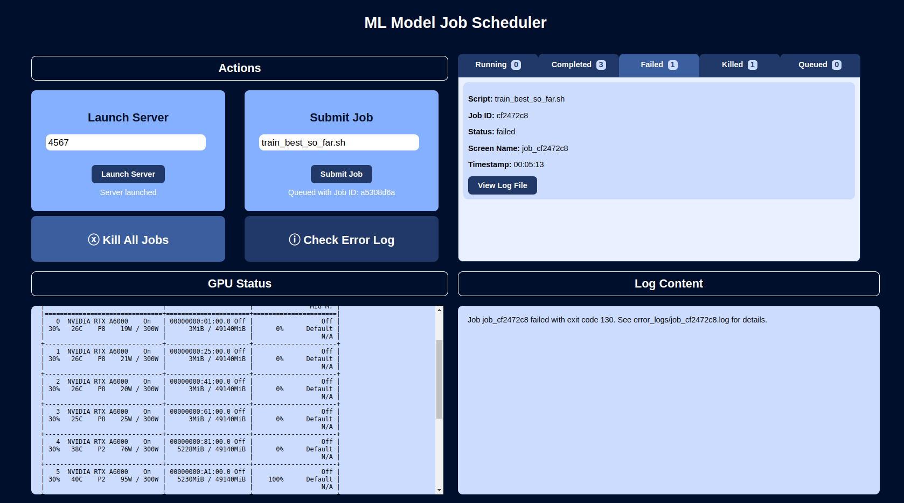

# Multi-GPU Job Scheduler
Job scheduler with multi-GPU compatibility and out-of-memory handling. 
### Fun Features:

📝 Automatically maintain run logs for your running and failed jobs, which you can view in-app!

❌ Kill multi-GPU jobs and all of their child processes in one click!

🔍 Check out a complete log of errored runs and their exit codes!

👁️ Keep an eye on your GPU usage with regular status updates displayed in-app!

### Directions To Run:
🌱 Install `requirements.txt` in your chosen environment

🏃‍♀️ Run `python app.py`, open the local link, and start scheduling! 📅

